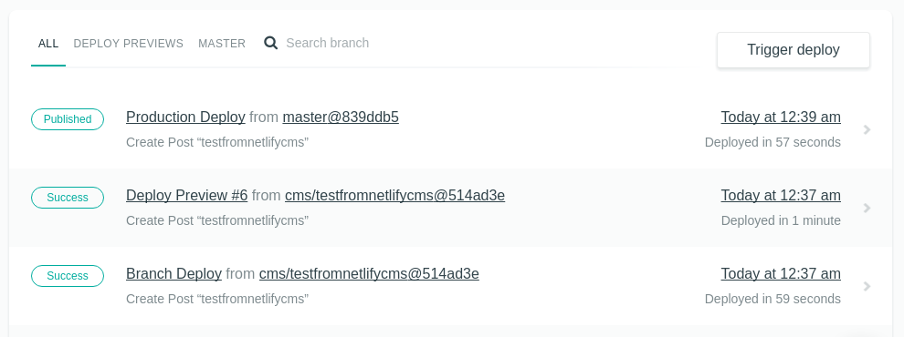

**There is a newer post about how to setup an Admin UI for GatsbyJS, and it's easier. Check it out [here](/cms-gatsbyjs).**

## Introduction

Recently, I was looking into [Gatsby.js](https://www.gatsbyjs.org/) as a generator for a blog site. As many others, I one of the first steps into using the system as other popular CMS solutions, I started to look around for an online back-end UI for the content creation part. I found this list of [headless CMS options](https://headlesscms.org/) and since [forestry](https://forestry.io/) (the service I use for my blog) does not support Gatsby, I decided to try [NetlifyCMS](https://www.netlifycms.org/). This tutorial will be about it :)

I'm not going into details on the separate services and software packages, their advantages and super features. Rather, I will keep the tutorial concise on how to integrate the systems.

If you like more background about the JAM stack, you can see previous mentions [here](/march-digest-2017/#jam-stack) and [here](/releasing-new-blog/) ;)

### Start

For the tutorial, assume I'm speaking about [gatsby advanced starterkit](https://github.com/Vagr9K/gatsby-advanced-starter) although same principles apply to which-ever starterkit or gatsby setup. The important part is to have markdown as data source, as well as well-defined front-matter parsed by [gatsby-transformer-remark](https://github.com/gatsbyjs/gatsby/tree/master/packages/gatsby-transformer-remark) and exposed to a GraphQL API within the Gatsby. In short, make sure you have markdown files so that the information you write is "understood" by NetlifyCMS and Gatsby, and others.

### NetlifyCMS

It's an open source decoupled back-end built on React, which [integrates with Github API](https://www.netlifycms.org/docs/intro/). I personally like this idea, because publishing work-flows actually translate to steps developers already take on code repositories.

To use this admin UI application easily, you can integrate it with the Netlify service which will watch for changes in your github repository and do the necessary builds, previews and deploys.

To make Gatsby work with this tutorial, you will need to:

* make a [page component](https://www.gatsbyjs.org/docs/building-with-components/#page-components) for the admin page, this should include the scripts loading the NetlifyCMS app

* include the `config.yml` file in `static` folder of Gatsby, as it does not need optimization by webpack

If you have configured Netlify service to take your master branch and execute `npm run build` on new deployments, a new push will already give you access to the admin UI app.

### Gatsby

This side might seem a bit more complex compared to copy-paste and rework to a small React component, but it's actually a simple process.

* move all markdown files into 1 folder, you need a flat structure, otherwise NetlifyCMS won't be able to list the existing content in the dashboard

* configure the `SiteConfig.js` ​to point to this folder containing the files

* configure also, by the way, configure also the `config.yml` of Netlify to be the same target

Check if all works, and if yes, make another deployment to the your repository. I personally removed all the unnecessary content manually and had to flush the cache of the last deploy in the console.

### The result

You have a modern tool-chain of React, GraphQL, webpack, and similar, called Gatsby, and you have a working administration UI to manage your content when you're lazy to open your editor ;)

Here's a [video of the process](https://github.com/kalinchernev/kalinchernev.github.io/blob/blog/static/videos/netlify-cms-gatsby.mp4) from making a draft which is a pull request, opening a preview and then publishing the change which gets automatically deployed on the site.
