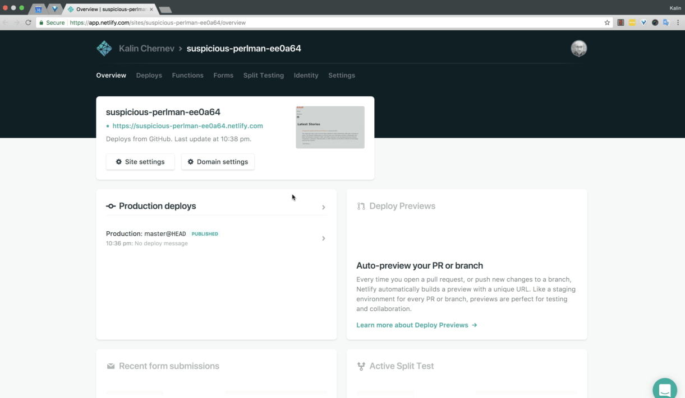

## Introduction

As I have previously mentioned, [NetlifyCMS is one of the most flexible "CMS" applications](https://kalinchernev.github.io/admin-ui-gatsby-static-site-generator) on the market at the moment. In the past you had to tweak both GatsbyJS and Netlify service configurations, so that the output of first was useful for the second. I shared about these details in a [story about migrating from Hugo to GatsbyJS](https://www.gatsbyjs.org/blog/2017-11-06-migrate-hugo-gatsby/#admin-panel). Few weeks after these shared stories, Netlify released [NetlifyCMS 1.0](https://www.netlify.com/blog/2017/12/07/open-source-netlify-cms-hits-1.0-bringing-git-based-content-management-to-static-sites-everywhere/). I think this release is a big milestone for the project because it involved a lot of work on [design perspective](https://github.com/netlify/netlify-cms/issues?q=is%3Aissue+is%3Aopen+sort%3Acomments-desc+label%3A%22area%3A+design%22) but also on authentication and integration parts which make the product easier to adopt.

A bit more than a month after this release, I have the feeling not many know about the improvements available. I blame the holiday season of December :)  And so in this blog post I'll share my personal impressions. I believe NetlifyCMS is still one of the best tools to have together with a static site generator, and it's also well-integrated with another great service - Netlify.

### Starting a project

When I published my thoughts on using NetlifyCMS and GatsbyJS together to make a modern web site with an admin panel, I started to get questions on twitter how I made a given project and how I organised my a repository. My reply was always pointing to [the repository storing the github pages for my username](https://github.com/kalinchernev/kalinchernev.github.io). A friendly way to say RTFM - the blog posts were the documentation I thought - just fork the repo and tweak it!

Some people succeeded taking an example, others didn't. The ones who didn't, didn't because making websites can be the job of a site builders and not developers. Being a site builder with experience and good expectation management with the client is good. So, starting a project should be easy. A successful WCMS product sometimes means starting with a visually appealing base, and being able to involve developers, where and when necessary on a later stage. WordPress with wordpress.com is an example of that. Start small, build a prototype, demo it, get trust for more work on a project, succeed, that's what I mean :)

And there's the first good news - starting with GatsbyJS and adding an administration panel hasn't been easier!

1) Go and [select the right starter](https://www.netlifycms.org/docs/start-with-a-template/):

2) Give your project a name

3) Accept invitation

When you start the creation of a new project, the new identity service of Netlify will create your user 1, and will send you an invite for it, just accept it :)

4) Reset your password

Because, obviously, it's not good if the credentials are done for you, ain't it?

5) Use your credentials to log in

### The administration panel

### Github

You can also still work in programmer's workflow with a repository

### Conclusions

Starting can't be easier and more examples and community support with time. No reason not to go for the JAM stack for your next CMS project :)
