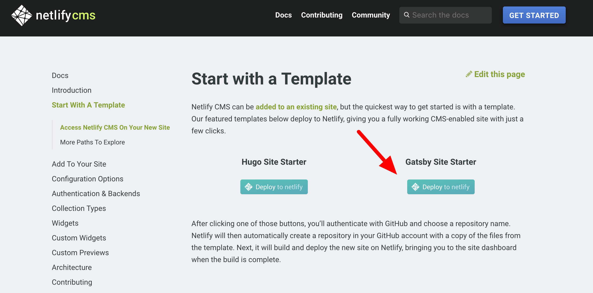
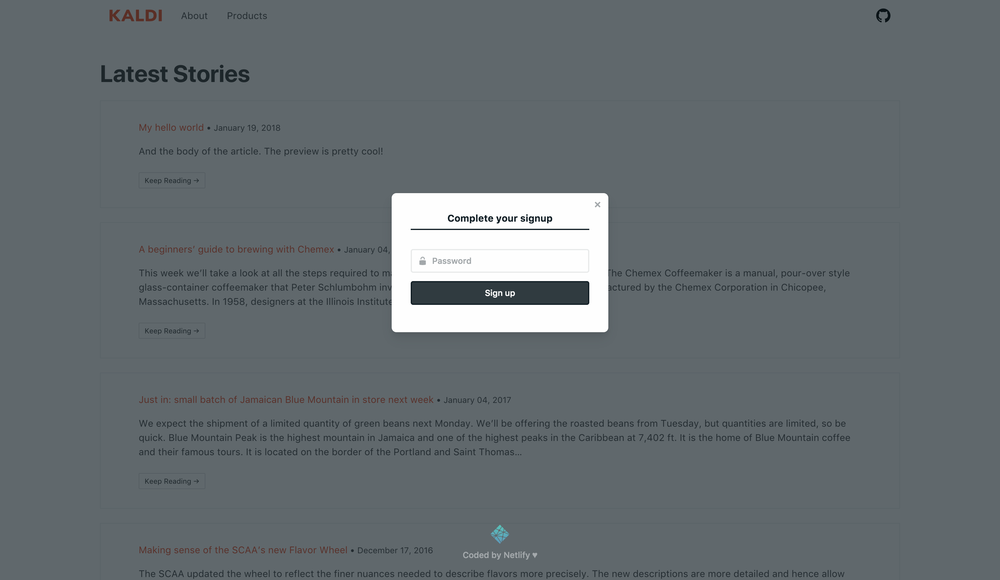
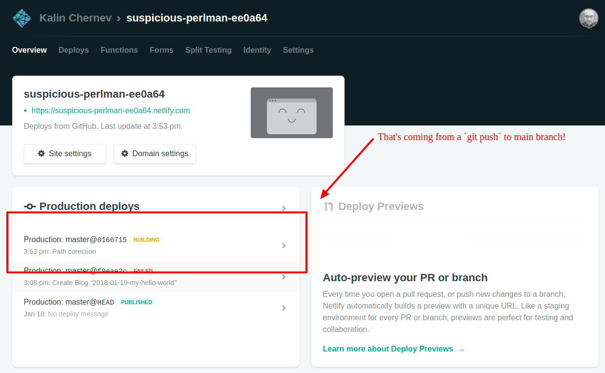

## Introduction

As I have previously mentioned, [NetlifyCMS is one of the most flexible "CMS" applications](/admin-ui-gatsby-static-site-generator) on the market at the moment. In the past you had to tweak both GatsbyJS and Netlify service configurations, so that the output of first was useful for the second. I shared about these details in a [story about migrating from Hugo to GatsbyJS](https://www.gatsbyjs.org/blog/2017-11-06-migrate-hugo-gatsby/#admin-panel). Few weeks after these shared stories, Netlify released [NetlifyCMS 1.0](https://www.netlify.com/blog/2017/12/07/open-source-netlify-cms-hits-1.0-bringing-git-based-content-management-to-static-sites-everywhere/). I think this release is a big milestone for the project because it involved a lot of work on [design perspective](https://github.com/netlify/netlify-cms/issues?q=is%3Aissue+is%3Aopen+sort%3Acomments-desc+label%3A%22area%3A+design%22) but also on authentication and integration parts which make the product easier to adopt.

A bit more than a month after this release, I have the feeling not many know about the improvements available. I blame the holiday season of December :)  And so in this blog post I'll share my personal impressions. I believe NetlifyCMS is still one of the best tools to have together with a static site generator, and it's also well-integrated with another great service - Netlify.

### Starting a project

When I published my thoughts on using NetlifyCMS and GatsbyJS together to make a modern web site with an admin panel, I started to get questions on twitter how I made a given project and how I organised a repository. My reply was always pointing to [the repository storing the github pages for my username](https://github.com/kalinchernev/kalinchernev.github.io). A friendly way to say RTFM - the blog posts were the documentation I thought - just fork the repo and tweak it!

Some people succeeded taking an example, others didn't. The ones who didn't, didn't because making websites can be the job of a site builders and not developers. Being a site builder with experience and good expectation management with the client is good. So, starting a project should be easy. A successful WCMS product sometimes means starting with a visually appealing base, and being able to involve developers, where and when necessary on a later stage. WordPress with wordpress.com is an example of that. Start small, build a prototype, demo it, get trust for more work on a project, succeed, that's what I mean :)

And there's the first good news - starting with GatsbyJS and adding an administration panel hasn't been easier!

1) Go and [select the right starter](https://www.netlifycms.org/docs/start-with-a-template/):

2) Give your project a name

3) Accept invitation

When you start the creation of a new project, the new identity service of Netlify will create your user 1, and will send you an invite for it, just accept it :)

4) Set credentials

If you want to invite others to contribute to your new website, or you want to change your email, you can use Netlify Identity console to manage users.

5) Enjoy your CMS :)

You will be automatically redirected the administration pages of your new site! Enjoy! :)

### The administration panel

One would expect that going to the [official docs](https://www.netlifycms.org/docs/), there would be a short overview or a tutorial about the features of the product. However, this is not the case, most probably because it's so simple :)

#### Content management

Clicking on "Publish" will put the content in the main branch of the repository and will trigger the build.

If you rather have an additional moderation step before content lands into production, you use the [`publish_mode`](https://www.netlifycms.org/docs/configuration-options/#publish-mode). For this, you'll need to change the code of the repository (the starter) created under your Github username.

#### Other settings

Content management features being quite straight-forward, by default the starter provides defaults which are common sense. For more advanced features and configurations options in the administration pages, you'll need to [use the `config.yml`](https://www.netlifycms.org/docs/configuration-options/) file in the repository as described in the docs.

In terms of GatsbyJS, this file should always be placed in the `static/admin` folder in order to be accessible by `window.netlifyIdentity`. Documentation pages already describe [how static files are handled](https://www.gatsbyjs.org/docs/caching/#static-files).

### Github

Although there's the NetlifyCMS for providing eye-candy and easy UI for content management, one can still use the "regular" content management workflows developers have - using the repository on Github to add new content and change existing content :)

#### Deploying changes

Pushing changes to main branch (master by default) will trigger the Netlify service to run another build of the project:

This workflow is similar to Heroku or other PaaS solutions.

#### Previewing changes

When moderation workflows are enabled, creating a draft from NetlifyCMS administration pages means that the tool will create a new pull request to the main branch on your behalf. You can do the same just as you are used to do working with the repository directly - creating a new branch locally and pushing it to a branch for a pull request.

[Netlify previews](https://www.netlify.com/blog/2016/07/20/introducing-deploy-previews-in-netlify/) are a popular useful feature [used by GatsbyJS project](https://github.com/gatsbyjs/gatsby/blob/936c33a262eba0d3e053e67396079c34507f5cb8/docs/docs/deploy-gatsby.md) and many others.

### Conclusions

I hope this short tutorial would be useful to those searching for an Admin UI for a static site generator, and most specifically GatsbyJS. The process has been greatly simplified which hopefully will further increase the adoption of the JAM stack.

The Gatsby Starter is welcoming, easy to get a GatsbyJS site up and running, so why not use this opportunity?
