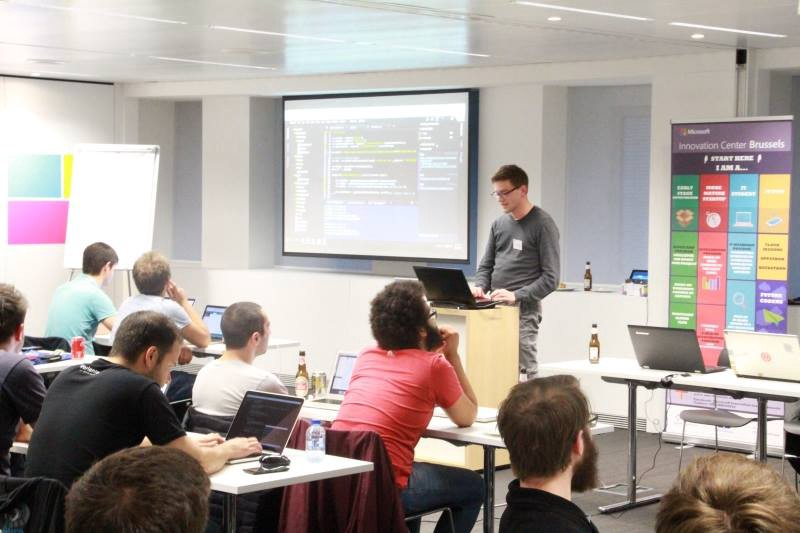

 ---
title: Coding battle at Microsoft Innovation Center Brussels
slug: coding-battle-microsoft-innovation-center
date: 2016-06-23T00:00:00+02:00
tags:
- JavaScript
- Bots
- hack events
---

Continuing on the exciting journey of coding battles and events, this time I'm so trilled on what happened that I can't wait to put my hands back to code. So the story will be short and simple, hopefully inspiring for you to try building some cool chat bots and join me in the next coding event.

#### [Chat Bots][1]

Recently, there's been quite some noise around the topic and many companies have already jumped into it — using and developing chat bots. The benefits, as I personally feel them: _for users, chat bots are a promise for better user experience, while for developers chat bots are a promise for cool task automation and beautifully integrated event-driven apps_. Of course, the biggest value is when a machine understands natural human communication and responds in a smart and useful way.

#### The Organisers

I have to say this was the best coding event I've ever been so far. The flow was really smooth, the whole atmosphere was really good, and there were winners with a result in the end, which is a real-life app with purpose.

The organizing team comprised of [CarASAP][2], [Microsoft Innovation Center][3] and [Philos][4]. Probably because of their good collaboration, the challenge was well prepared — clear problem definition, steps to solve, examples, ongoing support during the event, and last but not least — clear end goal in mind. In short, CarASAP presented their need to automate the process of car ordering for their customers, so that they can receive service via chat. Representatives from Microsoft were going around the room answering questions, showing small steps and debugging together with us — it was really friendly environment.

#### The Challenge

Participants were provided with a JSON file representing the time schedule of a list of drivers. Thus, the schedule was the base information for our chat bots assisting CarASAP customers to find and order a driver. They were able to input natural sentences which the bot should understand by learning: time, date and address. Read further to see which is the service used for understanding the natural speech.

**I think this event was a very good example how a business need can be solved elegantly in very short time with focused effort by a community**. I believe that this challenge set a good example for other companies to consider working with Philos too. Facilitating community contributions which solve real-life problems is a big thing. The way I see it, this is a Win-Win where developers learn, contribute and have fun, while business benefit resolutions and results.

In the end of the event, there was a demonstration of the working solution:

Credits: [Philos Lab][6]

#### Tools Best Practices

There was a lot of sharing during the event!

From the developers around me I learned about [ngrok][8], which was a handy tool to just start and run a local node.js server which is easy to integrate with other systems. It's a time-saver when there's no time to deploy an app to a cloud server. Deployment can be a painful part of the development.

From the winning team, I got inspired to research [cloud9][9] as a tool for collaborating during the next hack event, since it's another way to save from setup and deployment procedures which can lead to errors and frustration. Also, it looks awesome to be able to pair-program in real-time with other developers directly in the editor. Research homework for me :)

Managing API keys was another common setback for many. All I can say here is that it's just something that has to be handled with care, because if it isn't, it leads to mystical error codes without clear path to resolve. And a lot of time is wasted poking around debugging systems that should just work.

But don't worry, you are not alone with these issues! Here's a short motivational video that will make you laugh and encourage you to go forward :)

<iframe title="Video about Pair Programming a Facebook Messenger Bot" width="560" height="315" src="https://www.youtube.com/embed/zFO1cRr5-qY?rel=0" frameborder="0" allowfullscreen></iframe>

For building the bots, we used the [Microsoft Bot Framework][10]. I can't explain you how amazing the APIs are! Just head directly into the [documentation][11] and skim through some of the example code. I'm sure you'll see the easy way to start building functionalities, for which the code looks familiar to other [node.js frameworks][12]. Apart from the core bot framework for managing the communication, we used [LUIS][13] to understand the user natural language, and process the important information from it. As a developer, I give my respect to the people who have built the framework and its documentation. It took us just few hours to figure out the APIs and make a working product!

#### APIs are really cool!

I'm generally a big fan of [REST APIs][14] and everything related to building and consuming them. For me, it's a good architectural approach for decoupling logic and functionality to focus on solving specific problems in a re-usable way. (Yes, the [GraphQL][15] we hear about a lot recently solves some drawbacks of the design, still I think the first wave of common usage will be based on fetching data from existing REST APIs and mainly combining them.)

What I'm saying is that having the opportunity to work with [LUIS][16] API is really really cool, especially in a hack event like this coding battle. Using services to solve complex problems feels good, and honestly I think this is the other topic that could be re-used many times, just like building chat bots for various purposes and business cases.

<blockquote class="twitter-tweet" data-lang="en">
That&#39;s <a href="https://twitter.com/hashtag/API?src=hash">#API</a> <a href="https://twitter.com/hashtag/management?src=hash">#management</a> <a href="https://t.co/mV5CJD84t7">pic.twitter.com/mV5CJD84t7</a>
&mdash; Amancio Bouza (@AmancioBouza) <a href="https://twitter.com/AmancioBouza/status/738993707140190208">June 4, 2016</a></blockquote>

#### The Community

Living in Brussels and following almost every initiative from Philos, I feel that the community around is getting bigger and stronger. Especially because there are opportunities to get together, learn and share! Also, this particular coding battle was an excellent example of good collaboration and focused efforts which brought real-life useful results. I speak about good collaboration between the business side of CarASAP, Microsoft Innovation Center and Philos, but also the good collaboration of developers solving challenges together!

#### What’s next?

First, make sure you sign up for the next coding battle — it’s the last one from the 1st edition of the HackLeague. It sounds to be really flexible on the skills necessary for the challenges, expect a lot of creativity! :)

HackLeague and Coding Battles were new concepts, but it’s easy to see that they are getting more traction on every step. Just looking at the number of participants increasing and the challenges getting better formulation, I firmly believe in the bright future ahead.

I also believe that HackLeague will continue to improve, as the community grows and more companies join the game. The more companies, the more interesting problems to tackle, and finally — the more knowledge sharing.

I can imagine that with enough traction, Philos will be able to possibility develop some sort of divisions based on specific needs and markets: VR, IoT, security, algorithms, you name it. I hope these will come naturally with the upcoming partnerships and collaborations.

I really liked the way Max presented his vision during the last event:

> Let people learn and share with each other, the fun way. In other words: **gamification for people creating the future**.

Game on coders!

[1]: https://en.wikipedia.org/wiki/Chatbot
[2]: http://www.carasap.be/en/
[3]: http://www.mic-brussels.be/en/home/
[4]: https://www.philos.io/
[5]: https://cdn-images-1.medium.com/max/800/1*ZVk4GCCCk6zithaBa8I3-Q.jpeg
[6]: https://www.facebook.com/philos.io/
[7]: https://cdn-images-1.medium.com/max/800/1*7OYP5OSbEVuKgF4eIs9Xcw.jpeg
[8]: https://ngrok.com/
[9]: https://c9.io/
[10]: https://dev.botframework.com/
[11]: http://docs.botframework.com/builder/node/overview/#navtitle
[12]: http://loopback.io/resources/#compare
[13]: https://www.luis.ai/
[14]: https://en.wikipedia.org/wiki/Representational_state_transfer
[15]: http://graphql.org/
[16]: http://docs.botframework.com/builder/node/dialogs/LuisDialog/
