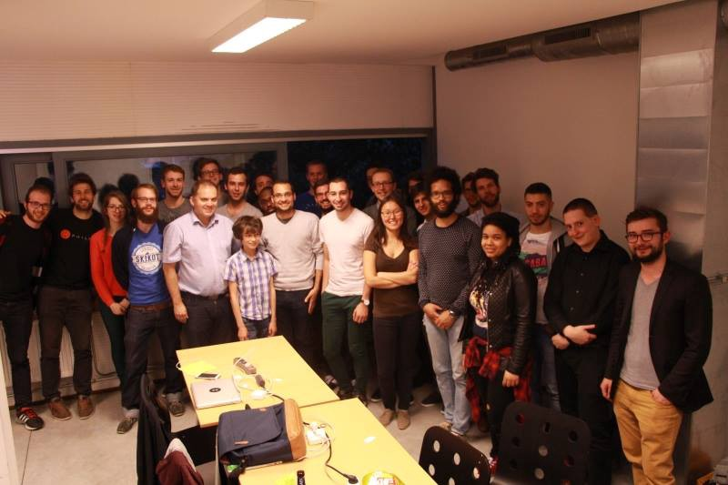

The last event from the series of coding battles organised by [Philos][1], this time in cooperation with Skygate on a life-saving topic using tools like Google Maps and Firebase.

#### Introduction

[Denis Omelcenco][2] from Skygate presented the challenge: make an app to locate the closest defibrillator. The initial code base contained helpful starting materials such as a [JSON file listing the defibrillators][3] and their locations, together with some [HTML files][4] to facilitate the app building. Also, [Max][5] provided additional helpful resources on [Google Maps API][6], [Firebase][7], etc. As you can imagine, the topic inspired the developers since it's based on meaningful cause.

In the spirit of "Never too early to start", there was a very young participant. I wish this inspires more lads and ladies to join in next events :)

#### The tools

The **Google Maps API** was the easiest for the developers, probably because it's a popular tool many of us had used before. Needless to say, good start examples were present, together with many answers on the internet on how to handle the various topics like directions, geo-locations, etc.

**Firebase** was a new tool for my team. The tool came super-handy on building an API based on an existing [JSON really really easy][10]. The only step necessary was to normalise the key:value pairs to have good naming for the import. Otherwise, we built a RESTful back-end with data about defibrillators in minutes.

[**Swift**][11] was also useful tool for some who decided to build a native app :)

#### Winners and working apps

In the end, there were 2 working apps: the one with Swift, and one with [the "starterkit"][14]. The final presentations of the projects gave some insights on the Google Maps APIs used.

#### Time to enjoy the summer :)

Next event will be somewhere in September, but it's not fixed yet because of the forthcoming summer months. To get notified for the next editions, just sign in the [meetup group][16] or in the facebook group page.

Thanks to Philos we saw a growing community and interest of hacking making small useful apps in very short time. Wish them luck and more opportunities for organizing even bigger projects in the future! :)

[1]: https://www.philos.io/
[2]: https://twitter.com/denisomelcenco
[3]: https://github.com/DenisSkygate/CodingBattle/blob/master/Defibrillators.json
[4]: https://github.com/DenisSkygate/CodingBattle
[5]: https://twitter.com/maxczet
[6]: https://developers.google.com/maps/
[7]: https://www.firebase.com/
[8]: https://cdn-images-1.medium.com/max/800/1*ZiiIav-nONmY-C8LqOIxdw.jpeg
[9]: https://www.facebook.com/philos.io
[10]: https://www.firebase.com/docs/rest/quickstart.html
[11]: https://developer.apple.com/swift/
[12]: https://cdn-images-1.medium.com/max/800/1*EEgjG4Ja_L5iScKDLYM2Yg.jpeg
[13]: https://www.facebook.com/philos.io/
[14]: https://github.com/DenisSkygate
[15]: https://cdn-images-1.medium.com/max/800/1*A5RYiojFrUUUxRklNiRT8Q.jpeg
[16]: http://www.meetup.com/javascriptlab/
[17]: https://cdn-images-1.medium.com/max/800/1*T1IwXqRxsa26rQ2Wu1Sf8A.jpeg
