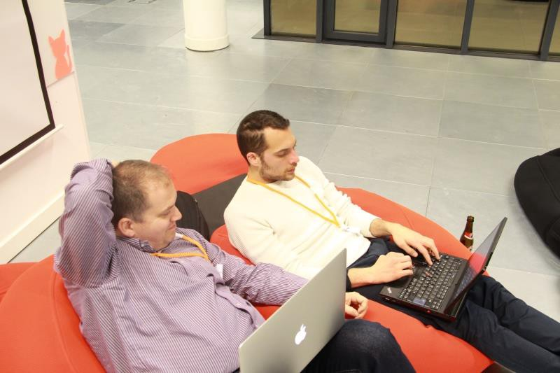
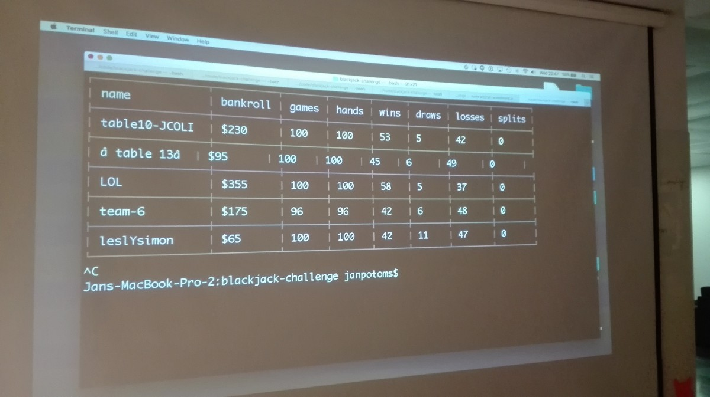

## Coding? Battle? What?

For me, coding is an act of expressing ways of thinking and problem-solving skills. However, in reality, it's a more than that. It's a proof of understanding complex concepts, and creating useful solutions with this understanding. Also, in fact, coding is frequently an act of showing narrow knowledge of a specific framework or knowledge of an API.

Battles, on the other hand, are not an every-day thing. Rap battles and games are fun though, why not take the same experience into another subject matter as an expression of quick-thinking and winning attitude?

Combining those, one can already enjoy online platforms like [codefights.com][1].

What happens in offline, face-to-face world though?

#### Coding battle

That's an opportunity to get experience actively. Battling is not only about watching a presentation, but solving problems. Quickly. And effectively.

Going into a battle is a learning experience.

#### The organizers

[Philos Lab][2] is a frequent organizer of [JavaScript events][3] around Belgium, Netherlands, Luxembourg and France.

[Woorank][4] is a product-oriented company who kindly prepared the challenges and hosted the battle.

Together, they organized the first coding battle in Brussels.

#### The battle

It was more enjoyable than you might think.

Honestly, I was doubtful about my own skills and readiness to go into a competition. That's because JavaScript is changing every day, learning fatigue is something normal.

In this competition, developers had to program a bot, playing against a dealer bot based on this [blackjack challenge][5]. The rules were simple, there were teams (4 rounds by 4), playing against each other on playoffs principle. The better ratio of games won vs games lost ruled winning teams to the top.

Personally, I enjoyed the challenge. It didn't require any previous knowledge of frameworks like Angular or React, but rather assumed general knowledge: variables, scope, functions and loops. That was really important in terms of facilitating the teams to focus on strategic thinking programming their automated bots, rather frameworks.

I believe these characteristics of the challenge were truly important. In the end, it was not really about whether or not developers know JavaScript or frameworks deeply, but rather: can developers understand requirements, code and logic quickly (2 hours and 30 minutes :), and provide solutions based on mathematics.

#### What did I learn

**1. Re-consider understanding the core algorithms**

Out of 2 hours and 30 minutes, I spent maybe around 40 minutes trying to figure out the structure of the code of the "dealer". (the server) That might have been useful if I knew specifically that my results/winning will be evaluated based on understanding other people's code. That's not impossible, but takes a lot of time! Take-away: listen carefully for the expectations. Reading and understanding API-s as-is is not helping in a battle.

Maybe it's useful to know the subject matter of the challenge, i.e. blackjack. Though every challenge will be different, I wouldn't focus on this in my next challenge.

**2. Focus on super-clear communication**

It happens every day, it happens in battles as well — discussing scope, persistence and making use of history of actions for future actions. There is no place for bad communication in a battle. Global scope is so much not an object scope. And dependency injection is not always possible, don't take it for granted.

**3. Focus on mathematics**

Even though I don't take myself as an expert in algorithms, making mathematical model of if-else-s is important. Me and my team-mate did not have any idea what a blackjack is, but we googled for strategies we translated into mathematics we implemented: and we ended up in the finals. You really have to experience this to believe it: creating code with clear mathematics that solves problems for you is beautiful.

**4. Team-work is important**

No need to go too deep into this. I was lucky with this one during the particular event. I worked together with a colleague I work with every day :)

Splitting down the small details was a breeze: which functions should do what, why, how, etc. The action was so hot that at some point using the "[for of][6]" syntax fit perfectly for the general foreach() equivalent for the major chunk for the decider logic. Believe me, there is no time to re-factor, questions like sugar in JS: Class vs Function, public method of a module vs private method of an instance are too tiny of topics in dynamic circumstances.

#### Community

In overall, the big winning was absolutely going into the community.

Good-bye picture at the spacious Woorank office

#### Bragging time

In this competition, my team reached the finals, team-6 ;)

This is the "table" server where bots (teams) play against a dealer (bot)

[1]: https://codefights.com/
[2]: https://www.philos.io/
[3]: http://www.meetup.com/javascriptlab/
[4]: https://www.woorank.com/
[5]: https://github.com/Woorank/blackjack-challenge
[6]: https://developer.mozilla.org/en/docs/Web/JavaScript/Reference/Statements/for...of
[7]: https://cdn-images-1.medium.com/max/800/1*-30-IAKNKmpFcSFesznhOQ.jpeg
[8]: https://cdn-images-1.medium.com/max/800/1*AgZQC_E-X4N3-R9XMrWQwg.jpeg
[9]: https://cdn-images-1.medium.com/max/800/1*ln13Rta5OBFPC4uorEtX7w.jpeg
