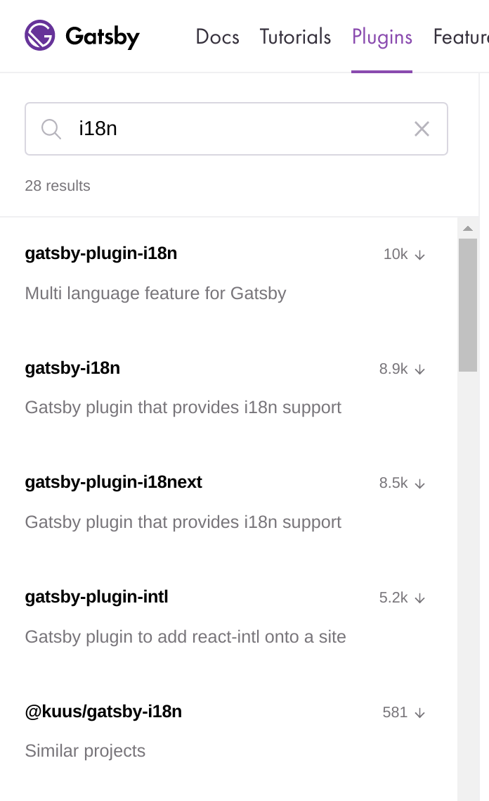

## Introduction

There are 24 official languages in the European Union. Creating a Gatsby.js website in so many languages is an edge case for which the [guide on localization and internationalization with Gatsby.js](https://www.gatsbyjs.org/docs/localization-i18n/) might not help.

In this article I'll reflect on the topic of i18n with Gatsby.js, the available plugins and core APIs. Mostly, how to use core APIs to create a scalable system for delivering multilingual static sites.

## Problem analysis

In my opinion, when evaluating approaches/tools for multilingualism with Gatsby.js, the solution should:

- Produce translated strings in both client/server rendered components.
- Follow best practices, using battle-tested utilities.
- Follow React.js patterns.

In short, the tool or the approach taken to solve the issue should be maintenable.

## Research

When working on a Gatsby.js project, a research phase would usually consist of browing the following sources:

- [Community plugins](https://www.gatsbyjs.org/plugins/)
- [Core plugins](https://github.com/gatsbyjs/gatsby/tree/master/packages)
- [Examples](https://github.com/gatsbyjs/gatsby/tree/master/examples)

When it comes to researching for "i18n":

Trying to get information about the first one `gatsby-plugin-i18n`, it leads to Github search `https://github.com/search?q=gatsby-plugin-i18n` which shows several repositories, some of them are forks of a very close relation.

The first one [angeloocana/gatsby-plugin-i18n](https://github.com/angeloocana/gatsby-plugin-i18n) uses `react-intl` and `i18next`. Looks promising with over 210 stars and separate packages for per-topic solutions. However, it automatically goes out of the shortlist - it will not be ok to have 24 files for every single page. Imagine a site with 10 pages which will explode to managing 240 files for a simple site!

The second one [ikhudo/gatsby-i18n-plugin](https://github.com/ikhudo/gatsby-i18n-plugin) also uses `i18next`. Has an unofficial? mirror at [hupe1980/gatsby-i18n](https://github.com/hupe1980/gatsby-i18n). Looking at code of `gatsby-i18n` and `gatsby-plugin-i18next` packages we see that documentation is scarce and both haven't been updated very frequently.

That's confusing: `gatsby-plugin-18` vs `gatsby-18n-plugin`, first being a "no-no" and second one being "can't start the starters".

The third plugin in the list is [`wiziple/gatsby-plugin-intl`](https://github.com/wiziple/gatsby-plugin-intl) uses `react-intl`. Shares approach and issues mentioned in `angeloocana/gatsby-plugin-i18n`: we can't afford per-language page.

Lastly, checking whether any of the top (most downloaded) plugins is used in a [core plugin](https://github.com/gatsbyjs/gatsby/tree/master/packages) or an [example](https://github.com/gatsbyjs/gatsby/tree/master/examples/using-i18n): the answer is no.

It's easy to see that `react-intl` and `i18next` are the go-to solutions in terms of using i18n frameworks, though at the same time

**top plugins are either not scalable or are not production-ready.**

Coming back to `wiziple/gatsby-plugin-intl` plugin which has a special [**WHY** section](https://github.com/wiziple/gatsby-plugin-intl#why):

> When you build multilingual sites, Google recommends using different URLs for each language version of a page rather than using cookies or browser settings to adjust the content language on the page.

Looking at the [example of using i18n](https://github.com/gatsbyjs/gatsby/tree/master/examples/using-i18n) it says:

> Example site that demonstrates how to build Gatsby sites with multiple languages (Internationalization / i18n) without any third-party plugins or packages. Per language a dedicated page is built (so no client-side translations) which is among other things important for SEO.

Having these and the awareness about the state of i18n plugins, it's natural to start on a new path of thinking: **HOW** to solve the problem without plugins?
