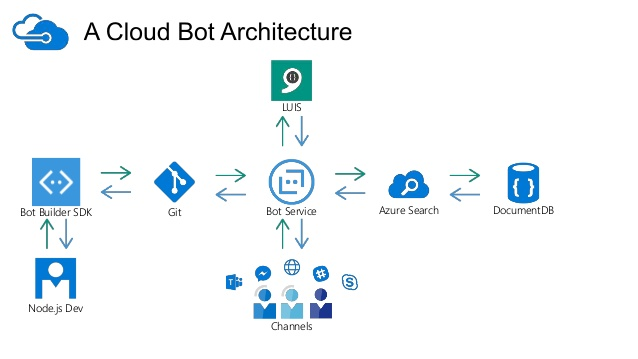

The [F8 event](https://www.fbf8.com/) took place recently and I managed to watch a video about
[the messenger platform](https://developers.facebook.com/docs/messenger-platform). Since it was during the Easter holidays, I also had few hours to make a simple chat bot for Facebook. Since then, I touched upon few of the topics around
the growing popularity of the so called [home assistants](http://www.crn.com/slide-shows/components-peripherals/300083432/10-cool-smart-home-assistants-at-ces-2017.htm). In this article I'll summarize some of the corners stones I found.

### Making a chat bot, this time on Facebook

For me the story began with [a coding event](https://medium.com/@kalin.chernev/coding-battle-at-microsoft-innovation-center-brussels-the-rise-of-the-bots-f0887c15e257)
at Microsoft almost an year ago when I "met" LUIS for the first time. Later, there was [the selfie chat bot](https://chatbotslife.com/building-a-chat-bot-who-understands-emotions-though-your-selfies-e9fa7cc4b627), which was fun and also easy to make. So, trying the messenger platform was easy and smooth experience. Here's a very short story of this journey:

- There's quite some tokens to be generated.
- I learned [ngrok](https://ngrok.com/) a bit better.
- I found that all this can be much easier with [api.ai](https://api.ai/).

Even though api.ai saves a lot of time in the setup of a chat bot for many platforms, it's still useful to go through the long configuration options in facebook in order to have a good idea about the possibilities.

A bit of an inconvenience it is that one has to make a page for the bot to live. Probably that will change with time. Follow [this guide](https://developers.facebook.com/docs/messenger-platform/guides/quick-start) to see what I talk about.

### Technical implementation of chat bots

If you are like me and you have reached this far to have setup 1 or 2 chat bots, a normal question to ask would be - what are the other platforms to build chat bots only with configuration? In the end, if it's so easy to make a bot for facebook, then probably there are other services right?

You can bet:

- [wit.ai](https://wit.ai/) - owned by Facebook since [5th January 2015](https://www.crunchbase.com/organization/wit-ai#/entity)
- [api.ai](https://api.ai/) - owned by Google since [19th September 2016](https://www.crunchbase.com/organization/api-ai#/entity) - Google Assistant which is integrated with this was announced in [May 2016](https://en.wikipedia.org/wiki/Google_Assistant)
- [LUIS](https://www.luis.ai/home/index) by Microsoft
- [rasa.ai](https://rasa.ai/) by [LASTMILE](https://golastmile.com/)

Can't help but putting [Darvin.ai](https://darvin.ai/) close to this list as well, as it's made in Bulgaria :)

All these share similar goals and ideas:

- Create a bot that takes input of human speech.
- Apply some NLP (natural language processing) or/and NLU (natural language understanding).
- Extract entities, sentiments, etc. out of the human input of information.
- Return information or call an API webhook to do some action based on the context.

Depending on your language needs, level of interests in the subjects and needs for privacy, you can go either way. Basically, the "brain" of the `.ai` is a cloud service communicating with clients via REST APIs, so that the intelligence can be reused in many ways.

Here's an example of using [Microsoft stack](https://www.slideshare.net/PaulPrae/azure-as-a-chatbot-service-from-purpose-to-production-with-a-cloud-bot-architecture)

> “Over the past decades computers have broadly automated tasks that programmers could describe with clear rules and algorithms. Modern machine learning techniques now allow us to do the same for tasks where describing the precise rules is much harder.” - [Jeff Bezos](https://futurism.com/amazon-ceo-perfectly-explains-ai-just-two-sentences/)

### Chat bots => Personal Assistants

In a recent [chatbot meetup](https://www.meetup.com/Brussels-chatbot-Meetup/events/238677762/) [Frédéric Feytons](https://www.meetup.com/Brussels-chatbot-Meetup/members/224607756/) made few points which resonated in me for a while. Here's a short summary:

- We are shifting from
the Personal Computer era to the Personal Assistant era.
- There are cases where assisting bots really help - Google maps telling us about the traffic in the morning, the [Pizza bot](https://chatbotsmagazine.com/5-use-cases-where-building-a-bot-makes-sense-c1bd3aab13db) confirming we want the same as before, etc.  
- Bots will not kill apps (we kill tools nowadays see ...) although the [chat experience can resemble the app experience](http://marketingland.com/facebook-messenger-adds-option-chat-bots-avoid-chatting-208255) to an extend.
- It's important to manage expectations towards our bots. They have models, but can't be super-smart at the moment. It's good to have a human interaction as a fallback in case the bot can't handle an important conversation out of a predefined script route.
- Facebook chat bots marketplace is still messy as discovering valuable bots (which are not actually people behind their facebook pages) is sometimes hard.

Although the [Moore's law is dead](https://www.technologyreview.com/s/601441/moores-law-is-dead-now-what/) (we kill ideas as well as technology stacks and tools nowadays) the big players are in yet another big game of AI which is related to the chat bots being personal assistants - the physical personal assistants! :D

### Personal assistants => ?

Amazon has been doing [quite well since the release](http://uk.businessinsider.com/amazon-echo-sales-figures-stats-chart-2016-12?r=US&IR=T) of the Amazon Echo, which already has several versions. Almost an year ago, Google made a [fast reply with Google Home](https://www.cnet.com/news/google-home-vs-amazon-echo/).

<iframe title="Video about Google Home" width="560" height="315" src="https://www.youtube.com/embed/2KpLHdAURGo?rel=0&amp;showinfo=0" frameborder="0" allowfullscreen></iframe>

Believe it or not, I realized just recently that Google announced [Google Assistant](https://assistant.google.com/) and Google Home together for a reason. For me, the assistant was this dummy chat bot with little sense of humour on Allo, but I never took him seriously, because the time it takes to open the app and start a conversation was taking more than actually doing the thing I wanted to do directly in the apps. Also, there are so many other chat apps on the market that I never even made a try to invite a friend to try Allo with some assistant spice.

In Europe, it's still not straight-forward to buy Google Home device in the same way it would be in the USA, so I was recently browsing for ways to emulate the device, and still have the Google Assistant in the box - it's integrated with [api.ai](https://developers.google.com/actions/) that I already tried for making the chat bot on Facebook!

Few days ago, the [#57 issue of MagPi](https://www.raspberrypi.org/magpi/how-to-get-aiy-projects/) got published with an interesting toy - a [Google AIY](https://aiyprojects.withgoogle.com/) - a do-it-yourself AI similar to Google Home :D
Google say that the assistant will be soon be published as an app for wide range of Android phones, but if you want to play with the actions sooner, and test if the this new wave would work for you or not - the AIY might be a really nice weekend / hack project.

__PS1__: Google I/O is coming really soon, and it's quite possible to see another product improving upon Google Home. The idea of trying the Assistant with some custom code/actions/webhooks from api.ai will still be a viable project regardless.

__PS2__: If you prefer to have the shiny device at home, better wait a bit, because Apple [probably has something in mind too](https://www.cnet.com/news/apple-exec-mocks-google-home-and-amazon-echo/) for this year ;)

__PS3__: If you are in the telco business, you might want to follow [the story around the European mobile network operators](https://www.bloomberg.com/news/articles/2017-04-20/european-telcos-team-up-to-take-ai-fight-to-google-amazon).
